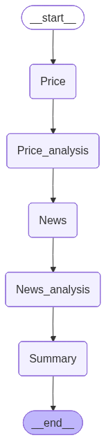

# 🚀 AI-Powered Crypto Market Analysis Dashboard



## 🔹 Project Overview
Developed a **real-time AI-powered crypto market analysis dashboard** that tracks live cryptocurrency prices and summarizes & analyzes news intelligently. Built with **Python, Streamlit, and LangGraph**, leveraging advanced AI models for actionable insights.

---

## 💡 Key Features
- **Interactive Line Charts**: Visualize live crypto prices.  
- **News Summarization & Analysis**:
  - **Perplexity Sonar Pro**: Fetches and summarizes real-time crypto news.  
  - **HuggingFace GPT-OSS-20B**: Provides deeper insights and analysis.  
- **Streamlit UI**: Smooth, interactive interface.  
- **LangGraph Integration**: Efficient API data fetching, processing, and organization.
---

## 🔍 Why These Tools?
- **Perplexity Sonar Pro**: Reliable real-time data aggregation.  
- **GPT-OSS-20B**: Delivers high-quality, actionable insights.

---

## 👥 Who Benefits
- **Investors & Traders**: Make informed decisions with live prices and news.  
- **Crypto Enthusiasts**: Stay updated with market trends.  
- **Researchers & Analysts**: Analyze patterns and sentiment efficiently.  
- **Beginners & Learners**: Learn crypto markets without tracking multiple sources.

---

## 🛠 Tech Stack
- **Languages & Frameworks**: Python, Streamlit  
- **Libraries**: Pandas  
- **AI & Data Processing**: LangGraph, Perplexity Sonar Pro, HuggingFace GPT-OSS-20B  
- **APIs**: Coingecko API, Reddit API (optional)

---

## 📈 Learning Outcomes
- Integrated **multiple AI models** for real-time news summarization.  
- Handled **live API data** and built **interactive visualizations**.  
- Developed a **complete end-to-end AI-powered crypto analytics platform**.

---

## 📥 Installation & Run

**Clone, install dependencies, and run Streamlit in one command sequence:**

```bash
# Clone repository
git clone <your-repo-url>
cd Crypto_Market_Analysis

# Install dependencies
pip install -r requirements.txt

# Run the Streamlit app
streamlit run src\app.py

```

---
## License
This project is licensed under the MIT License. See the LICENSE file for details.

